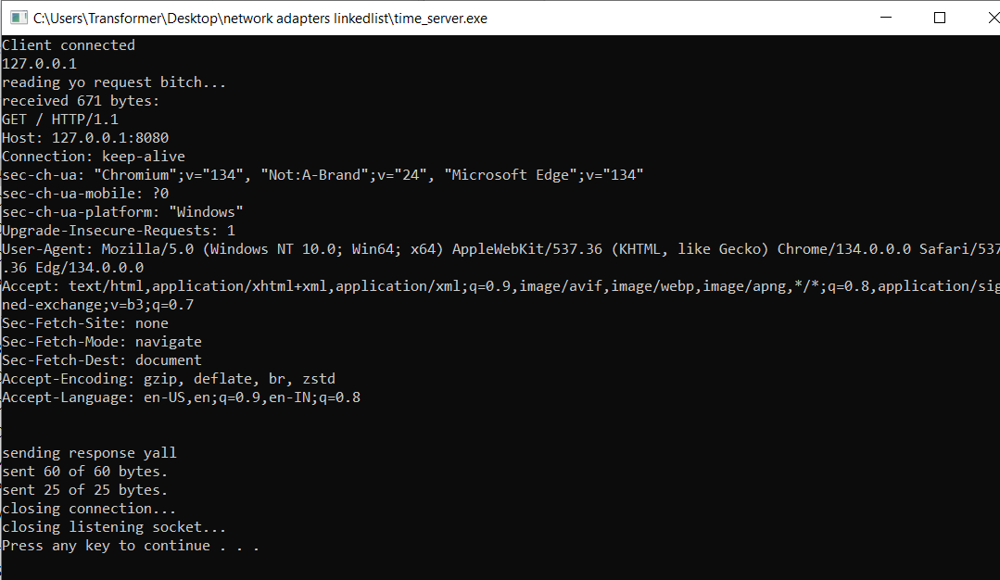

## Dependencies
Ensure the following libraries are linked during compilation:
- `ws2_32.lib` (Winsock library)
- `iphlpapi.lib` (IP Helper API library)

## How to Compile
For **MinGW**, use the following command to compile the code:
```bash
gcc win_list.c -o win_list.exe -liphlpapi -lws2_32
```


